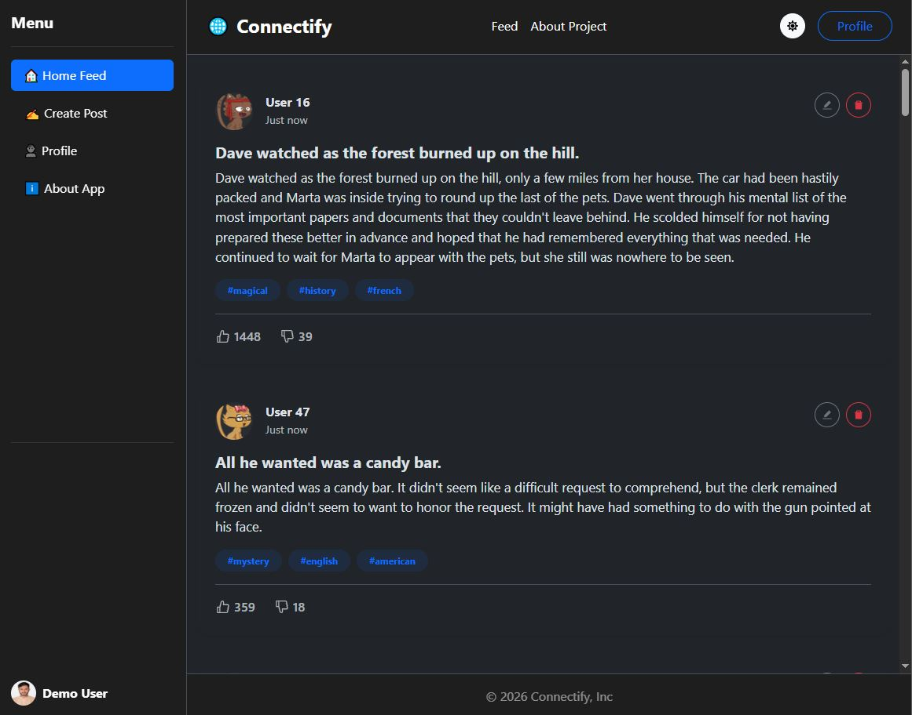

<div align="center">
  <h1 align="center">Connectify | Modern Social Feed</h1>

  <p align="center">
    A portfolio-ready React application showcasing advanced frontend architecture, dynamic theming, and complex state management.
    <br />
    <br />
    
  </p>
</div>

<!-- ABOUT THE PROJECT -->
## About The Project

Connectify is a polished, responsive social media feed application built to demonstrate professional React development patterns. Upgraded from a simple list app to a full-fledged showcase, it incorporates modern UI standards without relying on heavy external styling libraries, leveraging Bootstrap 5 and the Context API for an elegant user experience.

### ✨ Key Features

*   🌓 **Dynamic Theming:** Seamless Dark/Light mode toggling built natively with Bootstrap 5 variables and React Context API.
*   🔐 **Demo Authentication Flow:** Protected routes via custom higher-order components and fake JWT simulation for one-click demo access.
*   ⏳ **Skeletons & Error Handling:** Beautiful native loading skeletons (no external packages) and a custom 404 page for unmatched UX.
*   📱 **Responsive Design:** A mobile-first approach with sticky sidebars, adaptive grids, and collapsible headers.
*   🔄 **API Integration:** Dynamic data fetching for posts and content using modern React Router v6 loaders.

### 🛠️ Tech Stack

*   **React 19**
*   **Vite**
*   **React Router DOM** (v6+ Data Routers)
*   **Bootstrap 5** (Native CSS & JS)
*   **React Icons**

<!-- GETTING STARTED -->
## Getting Started

To get a local copy up and running, follow these simple steps.

### Prerequisites

*   Node.js (v18 or higher recommended)
*   npm

### Installation

1.  **Clone the repo**
    ```sh
    git clone https://github.com/your_username/Connectify-Social-App.git
    ```
2.  **Navigate into the directory**
    ```sh
    cd Connectify-Social-App
    ```
3.  **Install dependencies**
    ```sh
    npm install
    ```
4.  **Run the local development server**
    ```sh
    npm run dev
    ```

<!-- DEPLOYMENT -->
## Deployment Guide (Vercel / Netlify)

1. Connect your GitHub repository to Vercel or Netlify.
2. Set the build command to `npm run build`.
3. Set the output directory to `dist`.
4. Deploy! The `vite.config.js` is already configured for optimal production builds.

<!-- RECORDING DEMO -->
## Recording the 2-Min Demo Video

To record a solid 2-minute demo video for recruiters or LinkedIn:
1. Start at the `/login` page and explain the simulated authentication system.
2. Click "Login as Demo User" and show the seamless redirect to the protected Home Feed.
3. Toggle the Dark/Light mode from the header to demonstrate state management and CSS variables.
4. Refresh the page to show the Bootstrap Placeholder Loading Skeletons in action.
5. Navigate to the About App and Profile pages via the sidebar to highlight routing.
6. Deliberately type a bad URL to showcase the 404 Error page. 

## License

Distributed under the MIT License. See `LICENSE` for more information.
